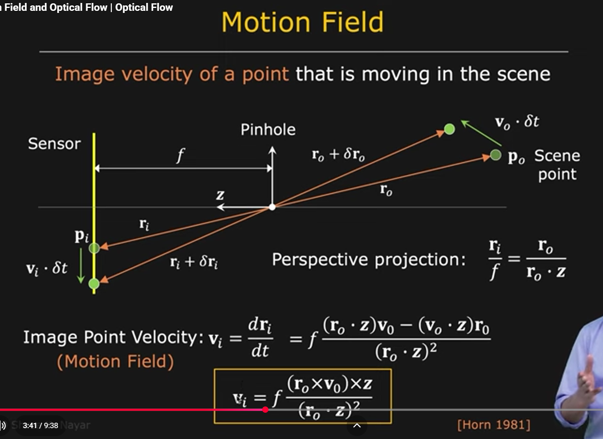
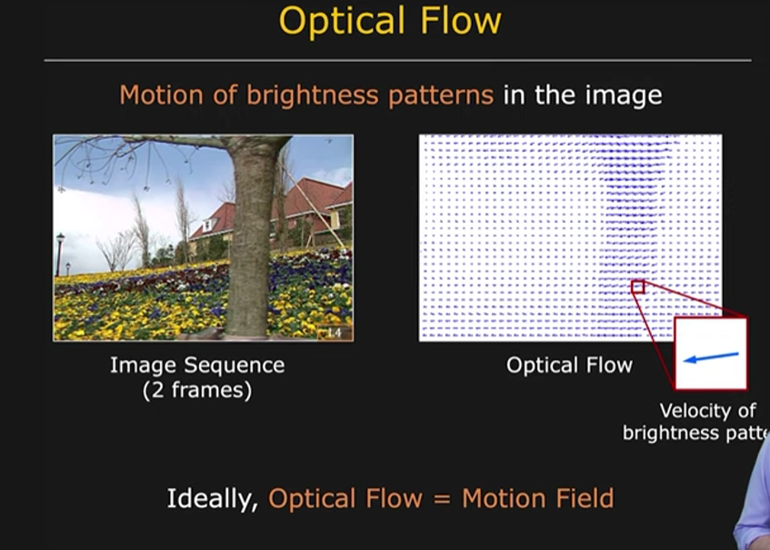
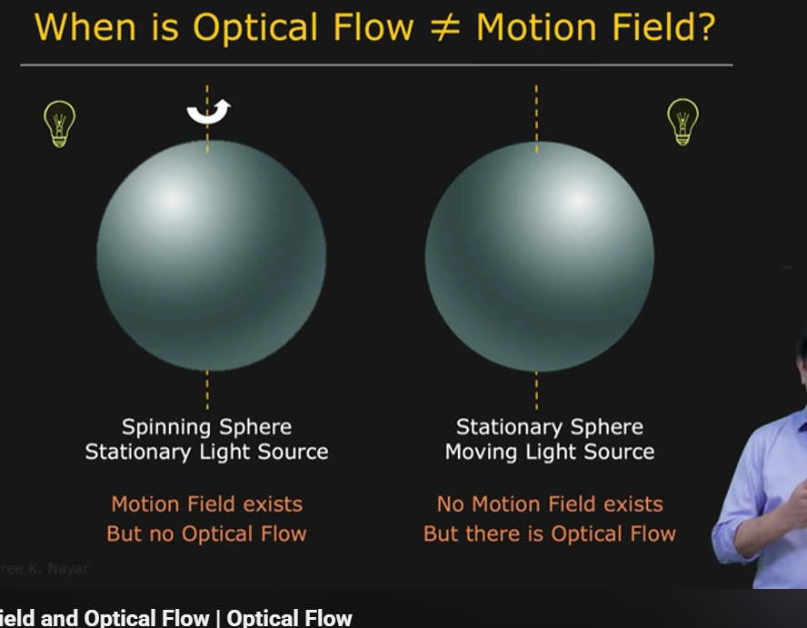
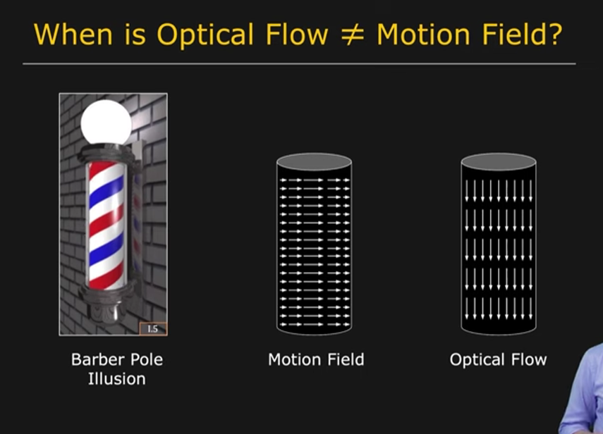

# Motion Field vs Optical Flow (Lecture 2)

## the idea

In the previous lecture:

we introduced optical flow as the apparent motion of brightness patterns.

At first this felt straightforward:

> things move → pixels move

But this lecture introduced an important distinction:

the thing physically moving in the world is not necessarily the thing we observe moving in an image.

There are two related but different ideas:

* motion field
* optical flow

Ideally:

$$
Motion\ Field = Optical\ Flow
$$

But real scenes are not always ideal.

---

## motion field

Motion field is:

the projected motion of actual 3D scene points onto the image plane.

Imagine:

a point in a scene:

$$
P_0
$$

moves with velocity:

$$
V_0
$$

That movement projects onto the camera image and creates movement:

$$
r_i
\rightarrow
r_i+\Delta r_i
$$

The corresponding image velocity becomes:

$$
v_i
=
\frac{dr_i}{dt}
$$

This image velocity is called the **motion field**.

Motion field depends on:

* object movement
* camera movement
* scene geometry
* depth
* perspective projection

Motion field represents:

> where physical points truly move.

---

## motion field projection geometry

The diagram immediately reminded me of class 11/12 NCERT ray optics.

Things I noticed:

* the pinhole behaves like the optical center
* focal length determines projection geometry
* moving scene points create moving image points
* depth affects image displacement

Perspective projection gives:

$$
\frac{r_i}{f}
=
\frac{r_0}{r_0\cdot z}
$$

where:

* f → focal length
* r₀ → scene point location
* z → depth axis

Differentiating with respect to time gives image velocity:

$$
v_i
=
f
\frac{
(r_0\cdot z)V_0
-
(V_0\cdot z)r_0
}
{
(r_0\cdot z)^2
}
$$

Meaning:

if we know:

* where the point exists
* how it moves in 3D

then we can predict:

* how its image projection moves

---

## NCERT connection: ray optics

This felt surprisingly familiar.

In ray optics:

* object position
* focal length
* image distance

determine image formation.

Small changes in object position shift the image.

Optical flow feels like extending that idea into time.

Instead of:

> where does the image form?

we ask:

> how does the image move?

Ray optics:

$$
\frac1f
=
\frac1v
-
\frac1u
$$

Optical flow:

project moving world points onto a moving image plane.

The underlying intuition feels similar:

> geometry in the world becomes geometry in the image.

---

## NCERT connection: relative motion

This also reminded me of relative velocity from class 11 motion.

Relative velocity:

$$
V_{AB}
=
V_A-V_B
$$

Motion depends on the observer.

Optical flow feels similar:

Observed image motion depends on:

* object motion
* camera motion
* projection

Meaning:

> the camera itself becomes an observer frame.

Interesting example:

When sitting in a moving train:

* nearby objects seem fast
* distant mountains appear almost stationary

Depth affects perceived motion.

Same idea appears in optical flow.

---

## optical flow

Optical flow is:

the apparent motion of brightness patterns in images.

Instead of tracking physical objects directly:

we track changing image intensities.

Optical flow tells us:

* direction of movement
* speed of apparent movement

---

## visualizing optical flow

The vector field image helped make the idea more concrete.

Each arrow contains:

* direction → movement direction
* magnitude → apparent speed

Interesting observation:

We are not directly measuring motion itself.

We are measuring:

> where image patterns appear to move.

---

## ideally

Ideally:

$$
Optical\ Flow
=
Motion\ Field
$$

But this only happens under assumptions like:

* brightness constancy
* stable lighting
* visible surfaces
* no reflections
* no occlusions

---

# when optical flow and motion field disagree

Reality creates some strange situations.

---

## case 1

### motion field exists but optical flow does not

Imagine:

* sphere rotating
* same material everywhere
* stationary lighting

Physical points move.

Therefore:

Motion field:

$$
\neq0
$$

But images remain identical.

Therefore:

Optical flow:

$$
=
0
$$

---

### reading the figure

This initially felt strange.

The sphere rotates physically.

So motion clearly exists.

But nothing changes visually.

The reason:

the surface contains no texture or changing patterns.

Interesting observation:

The shading pattern remains fixed.

Points underneath rotate, but visual evidence remains unchanged.

---

### intuition

Imagine rotating a completely plain white football.

Physically:

it rotates.

Visually:

nothing obvious changes.

Your eyes cannot track movement.

> motion exists physically but image evidence does not.

---

## case 2

### optical flow exists but motion field does not

Now imagine:

* sphere stays fixed
* light source moves

Object itself:

not moving

So:

Motion field:

$$
=
0
$$

But brightness patterns move across the surface.

Therefore:

Optical flow:

$$
\neq0
$$

---

### reading the figure

The object remains perfectly stationary.

Only illumination changes.

The bright region slides across the sphere surface.

Interesting realization:

The algorithm only sees brightness movement.

It cannot automatically tell whether:

* object moved
* lighting changed

---

### intuition

This felt similar to moving shadows.

Clouds move outside.

Shadows move across your room.

Floor:

not moving

Brightness pattern:

moving

---

## case 3

### both exist but they do not match

The cylinder rotates around a vertical axis.

Physical point motion:

→ → →

(horizontal)

But optical flow becomes:

↓ ↓ ↓

(vertical)

---

### reading the figure

Initially I expected horizontal movement because the cylinder rotates sideways.

But diagonal stripes dominate perception.

Following one stripe visually:

it appears to slide downward.

So optical flow follows:

brightness structure

not true object movement.

---

## connection to aperture problem

This immediately reminded me of the aperture problem from the previous lecture.

Locally:

only part of a pattern is visible.

Diagonal patterns create ambiguity.

The barber pole illusion feels like:

> aperture problem at a larger visual scale.

Local information creates incorrect global interpretation.

---

## humans get fooled too

Humans estimate optical flow as well.

Examples:

* moving wave illusion
* Ouchi illusion
* static images appearing animated

Interesting observation:

Nothing physically moves.

But visual patterns create perceived motion.

Meaning:

computer vision and human vision suffer from similar ambiguity.

---

## implementation thoughts

things to implement:

* simulate rotating sphere with texture vs without texture
* move light source while keeping object fixed
* visualize motion field separately from optical flow
* reproduce barber pole illusion
* compare sparse vs dense optical flow

possible experiments:

* illumination changes
* reflections
* camera movement
* textured vs textureless objects
* depth effects

---

## personal notes

Before this lecture I thought:

> optical flow = object motion

Now it feels more accurate to say:

> optical flow = what image intensities believe is moving

Interesting realization:

motion itself is never directly measured.

We infer it through visual evidence.

And evidence can sometimes lie.

Another thing that kept reminding me of NCERT:

In optics:

the image formed is not the object itself.

It is only a projection.

Optical flow feels similar:

the motion we observe is not necessarily true motion.

Sometimes we observe reality.

Sometimes we observe the image's interpretation of reality.